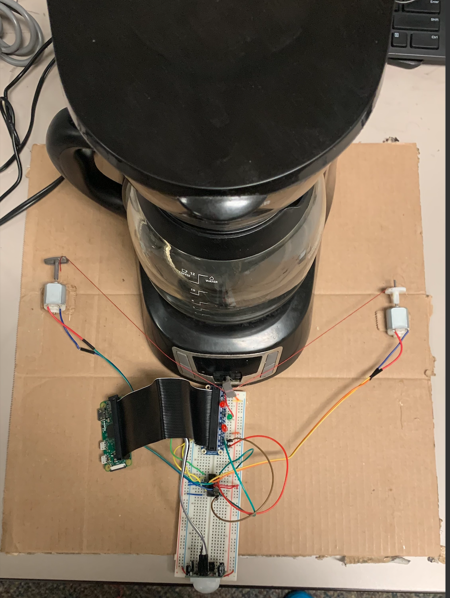

# Motion Controlled Coffee Brewer

    

The motion controlled coffee brewer uses a Passive Infared (PIR) sensor to detect
motion, a Raspberry Pi Zero as the micro controller, and two DC motors to actuate
the brewing button on the machine. The driver program for this application is
responsible for rotating the motors whenever motion is detected, displaying an
LED indicator for correct state of the motion detector (on/off), and implementing a reset button
to re-activate the PIR sensor after it detects motion. The technical documentation for this
project can be found [here](https://drive.google.com/file/d/1Rpww2GhvuFm4Qff4v9vDV1WNsM9XH1u4/view?usp=sharing).

How to compile the program:
1. Go into the directory containing the coffeeBrewDriver.py
2. Execute program by typing `python3 coffeeBrewDriver.py`
